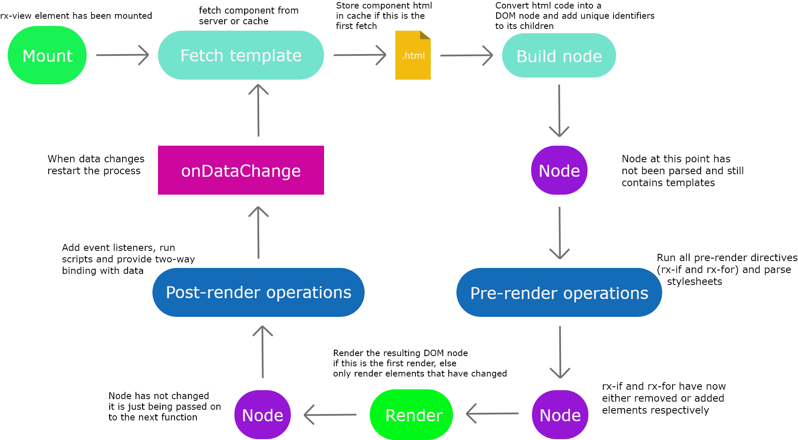

### RX

RX is a proof-of-concept library which aims to prove that component-based rendering can be achieved with uncompiled and static HTML files.

### Motivation

Using components as building blocks for a website is great but having to use compiler to convert it into browser-ready code is something beginners have a hard time doing, this is something i learnt while watching my friend try to get started with reactjs and although i do not in anyway condemn any library or framework for using compilers i believe it can be confusing for beginners who have not used the commandline.

### How it works

RX renders all components inside `views` which have `data` that are used by `directives` and `templates`.

* Views are represented by the `rx-view` element and the view's data is sourced from the rx-view attributes.

  An `rx-view` takes an attribute `component` which points at where the component to be rendered resides. This can point to anywhere not just on your server but also other servers across the internet.
  
    * Local Component
   
    ```html
    <rx-view component="./mylocalcomponent.html">
    </rx-view>
    ```
    
    * External Component
   
    ```html
    <rx-view component="https://anotherserver.com/path/to/component.html">
    </rx-view>
    ```

* RX uses attributes as a data source, this is because DOM events handle attribute change to an extent that is acceptable so (at least for this scale) there is no need to create our own listeners.

   Data that are accepted include `object`, `arrays` and `strings` and they are represented as such.
   
   1. Strings
   
       String are directly placed as variables without need for parsing or encoding
       
       ```html
       <rx-view component="myfile.html" name="Mainasara">
       </rx-view>
       ```
       
       this results in the data `{name: "Mainasara"}`
       
   2. Arrays
   
       Arrays are represented in JSON format.
       
       ```html
       <rx-view component="myfile.html" shopping_list="[1,2,3,4,5,6,7]">
       </rx-view>
       ```
       
       this results in the data `{shopping_list: [1,2,3,4,5,6,7]}`
       
   3. Objects
   
       Objects are also represented in JSON format
       
       ```html
       <rx-view component="myfile.html" user_info='{"name":"Mainasara", age: 18, "nationality": "Nigerian"}'>
       </rx-view>
       ```
       
       will result in `{"name":"Mainasara", Age: 18, "nationality": "Nigerian"}`
   
   Data can also be sourced from other places by using the `rx-data` element, this element can only be used within a view and it exepects an `src` attribute which points to a json resource.
   
   ```html
   <!-- userdata.html -->
   <div>
       <h5>{{username}}</h5>
       <p>{{bio}}</p>
       <p>Joined: {{joined_at}}</p>
   </div>
   ```

   ```html
   <!-- index.html -->
   <rx-view component="./userdata.html">
        <rx-data src="./user/data"></rx-data>
   </rx-view>
   ```

   where the data is `{"username": "neutrino", "bio": "A person that exists on earth", "joined_at": "27th December, 2017"}`, the resulting view becomes

   ```html
   <div>
       <h5>neutrino</h5>
       <p>A person that exists on earth</p>
       <p>Joined: 27th December, 2017</p>
   </div>
   ```

   But in the case of arrays the data becomes `{"rxdata": [...]}` and should be used like this

   ```html
   <!-- userdata.html -->
   <div rx-for="user in rxdata">
       <h5>((user.username))</h5>
       <p>((user.bio))</p>
       <p>Joined: ((user.joined_at))</p>
   </div>
   ```
* Directives are functions that are run on elements, these functions use the view's data to perform all kinds of operations. Directives look like this

    ```html
    <h1 rx-if="process.running">Running!</h1>
    ```
    The `rx-if` directive here is called on the h1 element with the condition **process.running**, this checks the view/scope data and evaluates the expression in a **sandbox**. Where the data is `{process: { running: true}}`, the expression evaluates to true and the h1 remains, else the h1 is removed.

    The default directives are

    1. rx-if
        The `rx-if` directive determines if an element should be rendered based on the expression passed to it.
        
        ```html
        <p rx-if="number > 40">Number is greater than 40</p>
        ```

        When the scope/view data is `{number: 44}` the element remains and is displayed on screen else if the data is `{number: 35}` then the element is removed and does not get displayed

    2. rx-for
        The `rx-for` directive uses an array to repeat an element, this is very useful for showing a list of items.

        ```html
        Shopping list:
        <ul>
          <li v-for="item in shoppingList">{{item}}</li>
        </ul>
        ```

        Where the scope/view data is `{shoppingList: ["Eggs", "Milk", "Cheese"]}` the element becomes.

        ```html
        Shopping list:
        <ul>
          <li>Eggs</li>
          <li>Milk</li>
          <li>Cheese</li>
        </ul>
        ```
    
    3. rx-model
    
        The `rx-model` directive creates two way binding between elements and data, so  a change in data causes a change in the element and vice-versa. _NB: this only works on inputs_
        
        ```html
        <h1>My name is {{name}}</h1>
        <input type="text" rx-model="name"/>
        ```
        
        When the scope/view data is `{name: "Mainasara"}` the element becomes
        
        ```html
        <h1>My name is Mainasara</h1>
        <input type="text" value="Mainasara"/>
        ```
        
        And when the input value is changed to "Harold" then the data becomes `{name: "Harold"}` and the element changes to
        
        ```html
        <h1>My name is Harold</h1>
        <input type="text" value="Harold"/>
        ```

* Templates are of two types, `static` and `dynamic`, and they are represented in different forms

    1. Static templates are denoted in a similar manner to the handlebars syntax and can not contain data that needs to be evaluated e.g `{{someFunc()}}`, instead the value needs to be directly available from the view data and most importantly static templates must not have any character between the braces and the variable name.

     Examples:

         1. Data from function
      
         The following code will result in an error because a static template can not evalute functions
      
         ```html
         <h1>Result: {{getMyResult()}}</h1>
         ```
      
         2. Object properties
      
         Javascript object properties have getters and setters which are functions at their core, this means the following code won't run either
      
         ```html
         <h1>Result: {{myObject.result}}</h1>
         ```
      
         3. Spaces are dangerous
      
         As mentioned above, spaces between the curly braces are not parsed because they won't be seen as static templates, so this code is invalid
      
         ```html
         <h1>Result: {{ result }}</h1>
         ```
      
         The right way to use the static template is like this.
      
         ```html
         <h1>Result: {{result}}
         ```
      
         these syntax choices might look odd but they were made for security reasons, the variables usually used inside templates are in most cases not meant to be evaluated so having non-evaluatable data paired with strict syntax makes it very hard for hackers to perform XSS and at the same time does not hinder a user's freedom.

    2. Dynamic templates start and end with two parentheses e.g `(( someFunc() ))` and its values are always evaluated, it can also span multiple lines.
    
     Examples
         
         1. Functions
         
         The following code will execute with no errors
         
         ```html
         <p>Some value is (( someFunc() ))</p>
         ```
         
         2. Objects
         
         Since templates can be evaluated, we can access object properties
         
         ```html
         <p>Window size is (( window.innerHeight ))x(( window.innerWidth ))</p>
         ```
         
         3. Multiline
         
         Dynamic templates are also multiline so inline javascript can be done.
         
         ```html
         <p>((
           (function(){
             console.log("loading");
             const result = document.getElementById("myInput").value;
             return Number(result)*myObject.multiplier;
           })()
         ))</p>
         ```
         

#### Lifecycle

Every instance of a component is managed by an `rx-view` element and each instance goes through the following lifecycle.



1. `rx-view` Element gets mounted and initializes event listeners.

2. Template is fetched from the server if it is the first render cycle, else the element should be cached so fetch from cache instead

3. Raw html from the previous step is parsed into a DOM node and its children get unique identifiers assigned

4. The pre-render RX directives are executed and elements get removed or added based on the data available in the view

5. The resulting DOM node gets rendered inside the view

6. The post-render RX directives are executed and data gets bound to the required element

7. When data changes go to step 2

#### TODO: Rendering